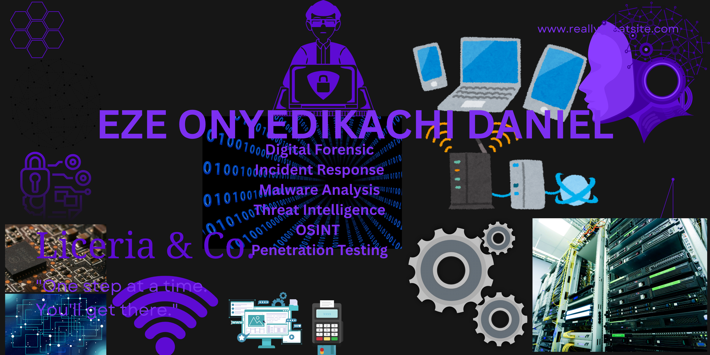

   

  
  
  

---

## 🧑‍💻 About Me

I am a cybersecurity Analyst specializing in OSINT INVESTIGATION, Malware Analysis, SOC Analysis and Digital Forensics, passionate about both offensive and defensive security. I enjoy building practical, hands-on projects that demonstrate real-world skills and prepare me for a career in security operations.

Currently seeking entry-level SOC Analyst / Junior Security Analyst roles where I can apply my skills in threat detection, log analysis, forensic investigation  and incident response.

---

## 🎯 Areas of Focus

| | Domain | Description |
|-|--------|-------------|
| 🕵️ | OSINT | Open-source intelligence gathering and target profiling |
| 🦠 | Malware Analysis | Static and dynamic analysis fundamentals |
| 🎭 | Social Engineering | Human-based attack vector simulation |
| 🔍 | Vulnerability Assessment | Scanning, enumeration and reporting |
| 💀 | Penetration Testing | Full-cycle pen testing and exploitation |
| 📋 | Log Analysis | Apache, IIS and Windows Event log investigation |
| 🏹 | Threat Hunting | Proactive identification of threats in log data |
| 🔬 | Digital Forensics | Evidence collection and analysis |

---

## 🛠️ Tools & Technologies

## 🌐  Digital Forensic

## 💻 Operating Systems

## 🌐 Networking

## 🔐 Cybersecurity Tools

## ⚙️ Dev & Version Control

---

## 📁 Projects

| Project | Description | Tools | Status |
|---------|-------------|-------|--------|
| 🕵️ OSINT Investigation | Conducted an OSINT investigation on a target system to gather intelligence and map attack surface | Coming soon | 🔄 In Progress |
| 🦠 Malware Analysis | Static and dynamic analysis of malware samples to identify behaviour and indicators of compromise | Coming soon | 🔄 In Progress |
| 🎭 Social Engineering | Simulated social engineering scenarios to understand human-based attack vectors | Coming soon | 🔄 In Progress |
| 🔍 Vulnerability Assessment | Scanned and assessed a target environment for vulnerabilities and produced a findings report | Coming soon | 🔄 In Progress |
| 💀 Penetration Testing | Conducted a full penetration test on a target system covering reconnaissance, exploitation, and reporting | Coming soon | 🔄 In Progress |
| 🔎 Log Analysis | Analysed 3 real-world Apache server logs (10,000+ entries). Detected Shellshock exploits, HTTP tunneling, and port scanning | Coming soon | 🔄 In Progress |

---
## 🏆 Certifications

| Badge | Certification | Status |
|-------|--------------|--------|
| !ISC2 | ISC2 Certified in Cybersecurity (CC) | ✅ Completed |
| !CompTIA | CompTIA Security+ | 🔄 In Progress |

---

---

## 🎓 Education

| Institution | Programme | Status |
|-------------|-----------|--------|
| 🏛️ Nigerian Army Institute of technology | Business Administration And Management  | ✅ Completed |
| 🏫 NIIT Port Harcourt | Cybersecurity Programme | ✅ Completed |
| 🏫 Nigerian Institute of Management | Graduate internship |  ✅ Completed

---

## 📊 GitHub Stats

  
  

## 📬 Contact

  

